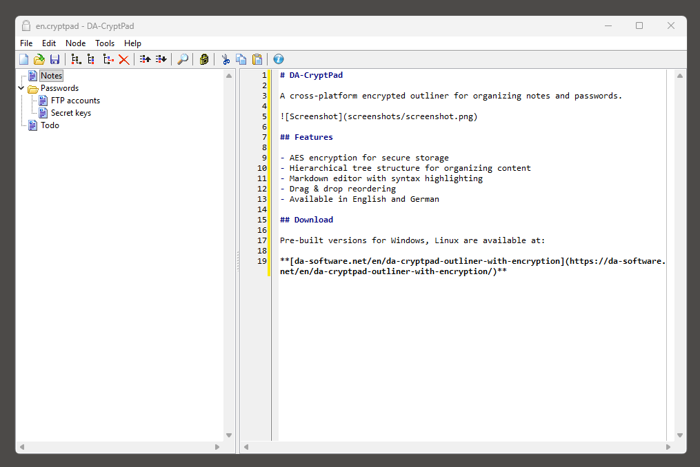

# DA-CryptPad

A cross-platform encrypted outliner for organizing notes and passwords.

## Features

- AES encryption for secure storage
- Hierarchical tree structure for organizing content
- Markdown editor with syntax highlighting
- Drag & drop reordering
- Available in English and German

## Download

Pre-built versions for Windows, Linux are available at:

**[da-software.net/en/da-cryptpad-outliner-with-encryption](https://da-software.net/en/da-cryptpad-outliner-with-encryption/)**
