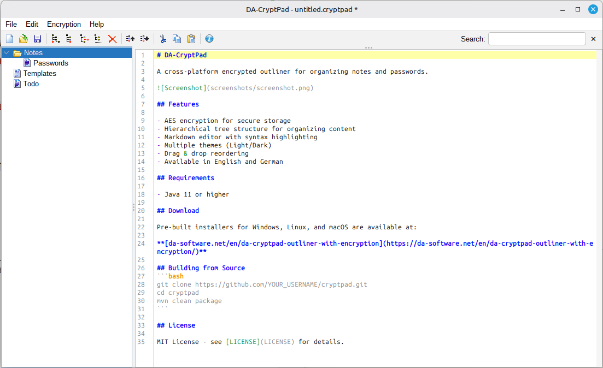

# DA-CryptPad

A cross-platform encrypted outliner for organizing notes and passwords.



## Features

- AES encryption for secure storage
- Hierarchical tree structure for organizing content
- Markdown editor with syntax highlighting
- Multiple themes (Light/Dark)
- Drag & drop reordering
- Available in English and German

## Requirements

- Java 11 or higher

## Download

Pre-built installers for Windows, Linux, and macOS are available at:

**[da-software.net/en/da-cryptpad-outliner-with-encryption](https://da-software.net/en/da-cryptpad-outliner-with-encryption/)**

## Building from Source
```bash
git clone https://github.com/YOUR_USERNAME/cryptpad.git
cd cryptpad
mvn clean package
```

## License

MIT License - see [LICENSE](LICENSE) for details.